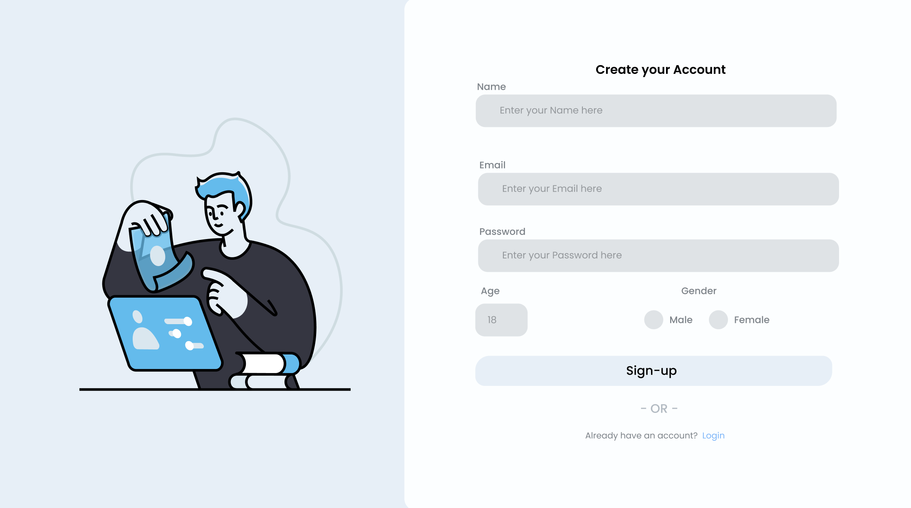
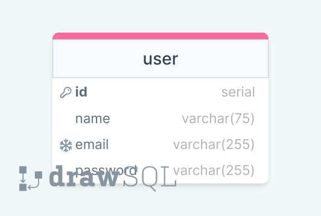

# MVP-Project

## Live Demo

Access the live version [here](https://mvp-project-8vf6.onrender.com).

## Setup

### Database Migration and Seeding

To migrate and seed the database for production, follow these steps:

1. Run the migration:

```
psql -f db/migration.sql EXTERNAL_DB_URL_FROM_RENDER
```

2. Seed the database:

```
psql -f db/seed.sql EXTERNAL_DB_URL_FROM_RENDER
```

### Shortcuts for Database Operations

Alternatively, you can use these shortcuts:

1. Connect to the database:

```
psql EXTERNAL_DB_URL_FROM_RENDER
```

2. Migrate:

```
\i db/migration.sql
```

3. Seed:

```
\i db/seed.sql
```

### Start the Application

```
npm start
```

## Learning Points (Authentication)

- **bcrypt**: A specialized hashing function that is deliberately slow to combat brute-force attacks.

  - [documentation: npmjs/bcrypt](https://www.npmjs.com/package/bcrypt)

- **hashing**: The process of converting a password to ciphertext using hashing algorithms. This is a one-way operation.

- **salting**: The practice of adding random characters before or after a password prior to hashing. This obfuscates the actual password and strengthens the hashed result against dictionary attacks and rainbow tables.

### Why Use bcrypt?

bcrypt is intentionally designed to be slow, consuming considerable computational resources. This design counters the advantage modern hardware provides to attackers, limiting their attempts from billions per second to thousands per second.

Structure of a bcrypt hash:

- Prefix identifying bcrypt: `$2b$`
- Work factor: if `10$` (The algorithm runs 2^10 or 1024 iterations)
- 22-character salt and a 31-character hash, for instance: `lNtVaIstq/hw5M6YhksiMeLS76WzMo62qrNKPMZfA3cvN1ov9EzXe`
- Prefix, hashed, salted: `$2b$10$xk6liURAG1rz4k5FwgWf0Oy1ecZDguFjMHUVFjHB6hplbJ1r.xJsS`

### Recommendations

The second-best way to ensure user data safety is to employ specialized hashing functions like bcrypt, scrypt, or Argon2. The best approach, however, is to abstain from storing passwords altogether. Opt for third-party authentication platforms such as "Sign in with Google" or "Sign in with Facebook."

# Figma

### Login / Sign up


### Figma Sign up



#### [Design here. Credit @ Saad Shaikh](https://www.figma.com/community/file/1287718860825078294/login-page)

### ERD


